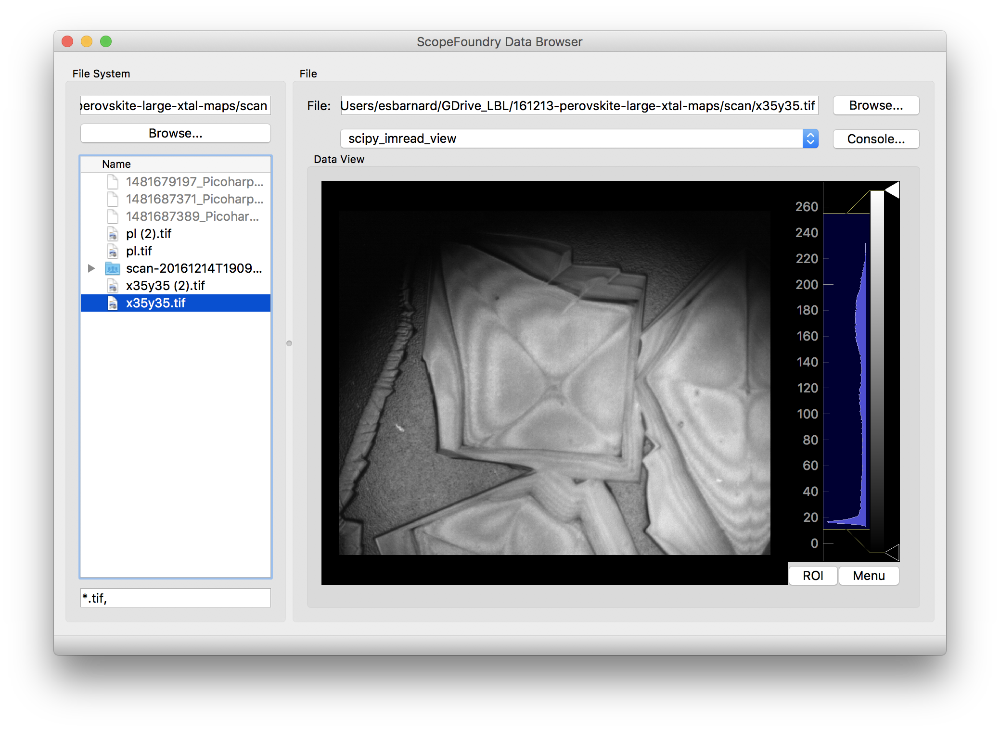

ScopeFoundry provides a DataBrowserApp that makes it easy for a user to explore a set of experiemental results on their computer. It is a plug-in based application, where data-type plug-ins (a `DataBrowserView`) can show relevant data within the file. The [FoundryDataBrowser] project is an example of the ScopeFoundry DataBrowser with a number of Views used to browse common experiemental data the Molecular Foundry.


## Setup

[anaconda_dl]: https://www.continuum.io/downloads

Note: We recommend the [Anaconda][anaconda_dl] python distribution, which contains many easy to install scientific python packages.


* Download and Install [Anaconda][anaconda_dl]. Recommended python version is 3.5.

* Create an [conda environment](http://conda.pydata.org/docs/using/envs.html) includes ScopeFoundry and its dependencies. Open an Anaconda prompt and run the following commands:

```
$ conda create -n scopefoundry python=3.6 anaconda
$ source activate scopefoundry 
(scopefoundry) $ conda install pyqtgraph
(scopefoundry) $ pip install ScopeFoundry
```

Note: On Windows `source activate scopefoundry` should be replaced by `activate scopefoundry`


## Defining a DataBrowserView


Lets define a custom view. We do this by subclassing the DataBrowserView class. Three methods should be defined `setup()`, `is_file_supported()`, and `on_change_data_filename()`.

Here is an example of a simple dataviewer that uses a PyQtGraph ImageView to display an image loaded via scipy (this file is called `viewers/images.py`
in [FoundryDataBrowser][FoundryDataBrowser]):

```python
from ScopeFoundry.data_browser import DataBrowserView
import pyqtgraph as pg
import numpy as np
from scipy.misc import imread
import os

#scipy imread uses the Python Imaging Library (PIL) to read an image

class ScipyImreadView(DataBrowserView):

    # This name is used in the GUI for the DataBrowser
    name = 'scipy_imread_view'
    
    def setup(self):
        # create the GUI and viewer settings, runs once at program start up
        # self.ui should be a QWidget of some sort, here we use a pyqtgraph ImageView
        self.ui = self.imview = pg.ImageView()

    def is_file_supported(self, fname):
    	 # Tells the DataBrowser whether this plug-in would likely be able
    	 # to read the given file name
    	 # here we are using the file extension to make a guess
        _, ext = os.path.splitext(fname)
        return ext.lower() in ['.png', '.tif', '.tiff', '.jpg']

        
    def on_change_data_filename(self, fname):
        #  A new file has been selected by the user, load and display it
        try:
            self.data = imread(fname)
            self.imview.setImage(self.data.swapaxes(0,1))
        except Exception as err:
        	  # When a failure to load occurs, zero out image
        	  # and show error message
            self.imview.setImage(np.zeros((10,10)))
            self.databrowser.ui.statusbar.showMessage(
            	"failed to load %s:\n%s" %(fname, err))
            raise(err)
```

## Running your DataBrowser

To use this view you can create a DataBrowser script like this:

```python
from ScopeFoundry.data_browser import DataBrowser
import sys

app = DataBrowser(sys.argv)

# views are loaded in order of more generic to more specific.
## ie the last loaded views are checked first for compatibility


app.load_view(ScipyImreadView(app))
    
# More views here

sys.exit(app.exec_())
```

You can download the complete script here: [databrowser_example.py](databrowse_example_py.md)


Here is a resulting screen shot of running this data browser script and navigating to a folder with TIFF images.




## Where to Find More

This example is part of the [FoundryDataBrowser] repository. There are many more examples of DataBrowserViews available for download there.

For questions about this tutorial or ScopeFoundry in general, please visit and post on the ScopeFoundry [project mailing list / forum](https://groups.google.com/forum/#!forum/scopefoundry)

For Source Code of all ScopeFoundry sub-projects visit our [GitHub page](https://github.com/scopefoundry/)